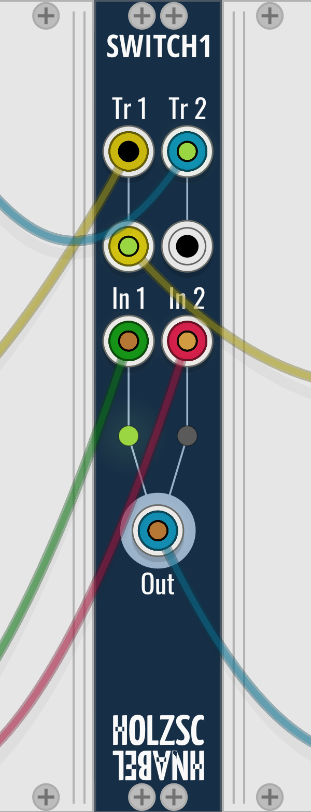
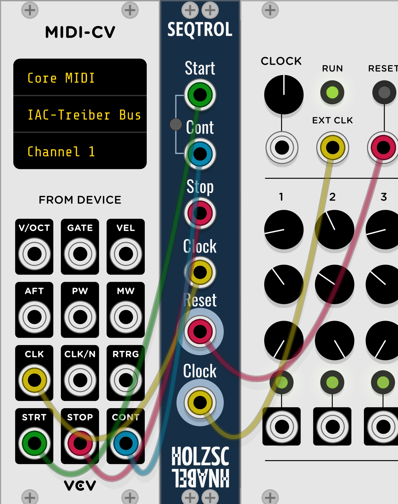

# GoodSheperd VCV Rack plugins

A collection of plugins I use for live performances. And yes, it’s a typo but I won’t fix it.

## Switch1

A non-toggling latching 2:1 switch. You can select one out of two input signals to be forwarded to the output. With a trigger pulse on a trigger input the respective input can be selected.

### Inputs

**Tr 1 (2x)/Tr 2 (2x):** Two trigger inputs for each In (OR-linked). A rising edge triggers. If Trigger 1 and Trigger 2 are fired simulataneously, Input 1 always wins.

**In 1/2:** Signal inputs.

### Outputs

**Out:** Switch output.

 

### Typical wiring

 

## Sectrol

### Inputs

**Start:** Connect with the *Start* output of your MIDI module. A trigger signal sends a reset and forwards the clock to the *Clock* output.

**Cont:** Connect with the *Continue* output of your MIDI module. A trigger signal forwards the clock to the *Clock* output.

**Stop:** Connect with the *Stop* output of your MIDI module.  A trigger signal stops the clock at the *Clock* output.

**Clock:** Connect with the *Clock* output of your MIDI module. Use the raw clock here, do not use the Clock Divider from the MIDI module! See [Context Menu](#context-menu).

### Outputs

**Reset:** Connect with the *Reset* input of your sequencer module.

**Clock:** Connect with the *Clock* input of your sequencer module.

### Context Menu

**Clock divisor:** Set the note value of the *Clock* Output. There are 96 MIDI clock ticks per whole note.

 

### Typical wiring

 

## Stable16

An eight track gate sequencer with independent start/end points and nudge functionality.

**Caveat:** it is very likely that this thing will grow a few more units in the foreseeable future. So if you use it in your patches please give it some space. ;)

## Hurdle

An uncertain switch: Depending on the voltage at the **P**robability Input, a signal at the gate input may or may not trigger the gate output.

* **P** in: Switching probability. 0-10V. The higher the input voltage, the more likely there will be a Gate signal at the **Gate out**put. 0V-10V corresponds to 0%-100%.
* **Gate in**: Gate Signal (0/10V). When a rising edge occurs, the voltage at the **P** input is being sampled as the probability.
* **Gate out**: Gate Signal (0/10V). Based on the **P** input voltage a gate signal may or may not be present at this output.

## SEQ3st

A modified [VCV Rack Fundamental SEQ3](https://vcvrack.com/Fundamental.html) with stochastic gate outs per row. So you may use the CV as gate probability for the given step in the given row.

* **P Gate** out 1-3: Gate Signal (0/10V). Based on the current CV value a gate signal may or may not be present at this output.

## Stall

Splits trigger/gate signals by a control voltage. Accepts control voltages corresponding to midi notes 35 to 82.

* **CV in**
* **Gate/Trigger in**
* **Gate/Trigger out 35-82**
